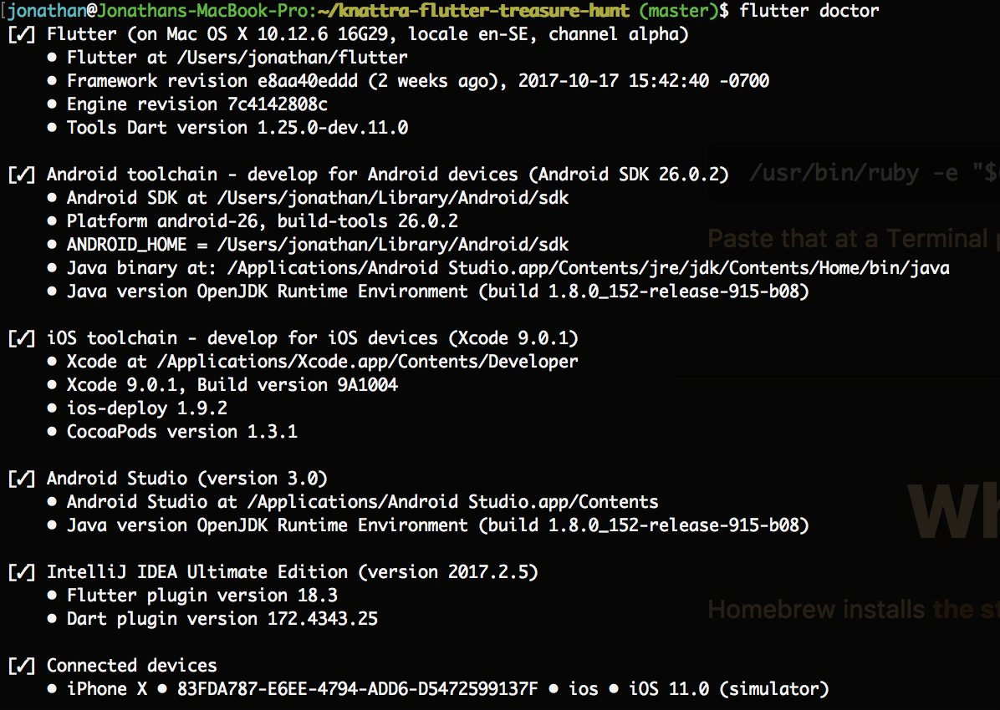
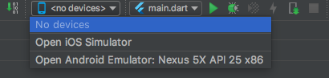
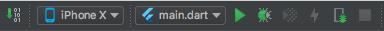
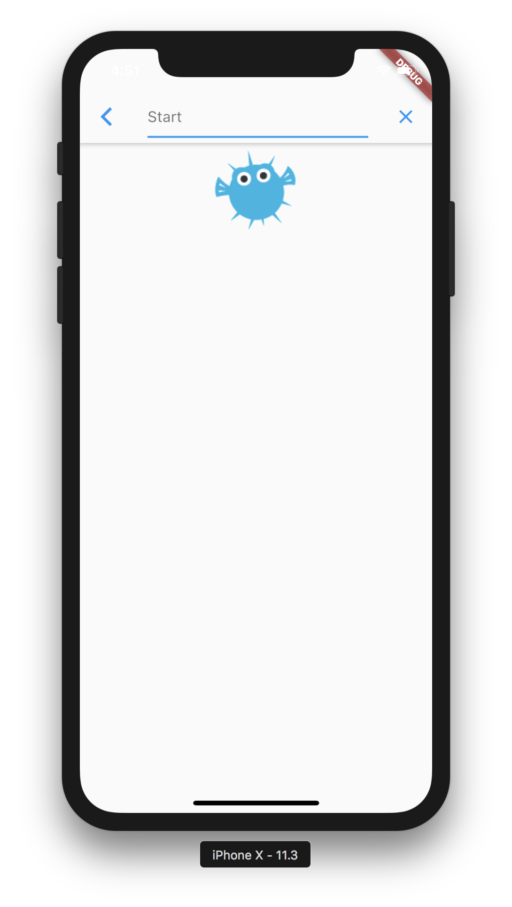
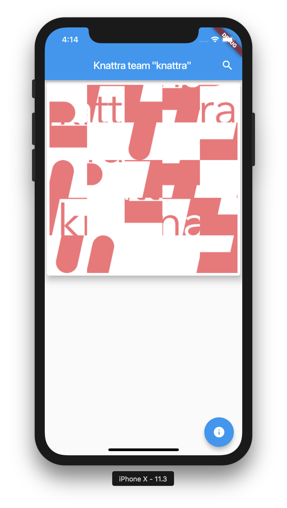

# knattRace
Flutter treasure race for the knattra event
## Prerequisites
You will need either:
 - Android Studio with Android SDK installed (and Android Emulator if you don't have a phone)
 - If you have a mac: Xcode, [brew](https://brew.sh/)

Either will work, and ensure you can run an app before you move on. Try a "Hello World" example to be sure.

## First challenge
You will have to register your team and a password to enter the competition. This is done through a POST request to:
 
`https://etuu2mjcx3.execute-api.eu-west-1.amazonaws.com/v1/teams/register`

The request body should be in the following format, upper case is where you fill in own credentials:

```json
{
  "teamName": "YOUR_TEAMNAME_HERE",
  "password": "YOUR_PASSWORD_HERE",
  "teamSize": "NUMBER_OF_PEOPLE_IN_YOUR_TEAM e.g. 3",
  "members": [
    "KING OF SWEDEN",
    "JOHNNY DEPP",
    "FIDEL CASTRO"
  ]
}
```

A great tool to make HTTP requests is [Postman](https://www.getpostman.com/), but you can use whatever tool you like.

## Getting into the race
- [Install Flutter](https://flutter.io/setup/). We really recommend IntelliJ or Android Studio with the Flutter Plugin, but it's fully possible to use which editor you like (Atom and VSCode also has Flutter plugins, but with inferior developer experience).
- Make sure you fullfill either the Android or iOS toolchain when running `flutter doctor` 
- Clone this repository and open the **repository folder** in the editor you like. If you use IntelliJ or any other IDE with  a Flutter plugin, set the Flutter SDK path.
- Fill in the team credentials at the top of [KnattraHomePage.dart](lib/KnattraHomePage.dart)
- All app code is under the [lib](lib) folder, and the code which you will solve the challenges are in [solutions.dart](lib/solutions.dart).
- Connect a phone or start an emulator, in IntelliJ it is in the upper right corner
- Start the app by pressing the "play" button, upper right in IntelliJ  or in the terminal `flutter run`, when standing in this repository folder.
- In the app, press the search icon and enter "Start"



- It should look like the following: 



- Press the FAB, it should tell you what needs to be done to solve the challenge.
- Go to [solutions.dart](lib/solutions.dart), there is a function named `firstSolver()`. There is a line commented out that solves the challenge for you.
- Refresh the app by pressing "Hot Reload" or "Run" in the upper right corner of IntelliJ. Repeat the steps where you go to the next challenge and enter "Start again".
- To solve remaining challenges, connect challenge names in the `switch` statement with the solving functions [solutions.dart](lib/solutions.dart).

# Good Luck!
